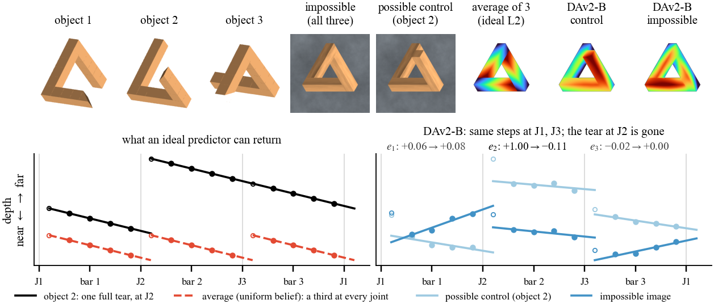

# Three Objects, One Image

**Depth Networks Read an Impossible Figure One Joint at a Time**

Itamar Shalom, Yalli Lavi, Dotan Greenspan, Shalom Biton. Final project, Modern Computer Vision (00970202),
Technion, 2026.

Report: [paper/main.pdf](paper/main.pdf)



A Penrose-triangle image is, pixel for pixel, the orthographic image of three different straight-bar objects (an open
chain of bars with its gap at joint 1, 2 or 3). Around the loop the bars keep coming nearer, so a depth map with rigid
bars must jump back somewhere. The mean of a belief over the three objects, and any single object, pays that whole
mismatch at the joints.
We render the image with the exact depth of all three objects, run ten frozen depth networks on it, and measure how
much of the mismatch the joints pay. They pay little (-0.19 to 0.32 of it): each joint gets about the depth step it gets
as an ordinary joint.

## What is where

| path | what |
|---|---|
| `pdepth/render.py` | orthographic cube-chain renderer: the shared impossible image, each object's exact depth, possible controls, the gap morph, shade permutations; side views of the trimmed objects |
| `pdepth/readout.py` | per-cube depth profile around the loop (median over eroded cube masks) |
| `pdepth/loop.py` | loop bookkeeping: each bar's line, the jump at each joint, closure |
| `pdepth/analysis.py` | loading the read-out tables, bootstrap intervals |
| `pdepth/models.py` | runners for Depth Anything V2 S/B/L, MiDaS DPT-L, ZoeDepth, Lotus-D/G, Marigold v1.0/v1.1, Marigold E2E-FT |
| `scripts/make_stimuli.py` | renders the 460 stimuli (sets A-E; see the script's docstring) |
| `scripts/run_models.py`, `scripts/run_marigold.py` | one model on a set of stimuli (and seeds / DDIM steps); one read-out row per image and seed (and DDIM step count) |
| `scripts/queue_vm.sh`, `scripts/queue_vm3.sh` | the full GPU run in the order used on the course's A10 VM; they hard-code that VM's Python and folder (see below) |
| `scripts/gt_profiles.py` | ground-truth loop profiles of the three objects for every stimulus |
| `scripts/analyze_excess.py` | **main analysis**: excess tear per joint against each network's own possible controls |
| `scripts/analyze_joints.py` | joint locality: impossible image vs matched possible control, joint by joint |
| `scripts/analyze_bars.py` | bar slopes normalised by each network's own controls: a test for a mixture of the objects and their depth reversals, inconclusive because the controls' own bar slopes are read inconsistently |
| `scripts/analyze_diffusion.py` | excess tear for the samplers, per seed and per number of DDIM steps |
| `scripts/paper_numbers.py` | prints every number in the report that no other script prints: the read-out's accuracy on the ground truth, readability gate, half-tear pixel counts, ordinary-joint step sizes and the bound they put on an upright/reversed mixture, image counts |
| `scripts/sensitivity.py`, `scripts/morph_pixels.py` | read-out robustness; pixel counts of the gap morph |
| `figures/fig_hero.py`, `figures/fig_main.py`, `figures/style.py` | the report's two figures (Fig. 1 and Fig. 2); shared labels, colours and style |
| `theory/`, `docs/theory.md` | what an ideal predictor returns under each loss, with numerical checks |
| `results/` | every read-out table (small CSVs) and the summaries the analyses write |
| `paper/` | LaTeX source of the report |

## Reproduce

Run every command below from the repository root (the theory checks run from `theory/`; see `theory/README.md`).

```bash
# 1. environment (Python 3.10+): install PyTorch and torchvision for your platform first, then
pip install -r requirements.txt
# 2. stimuli (CPU; ~2 min with 30 processes on a many-core machine, longer on a laptop)
python scripts/make_stimuli.py data/stim2 30    # 292 render jobs; A and B are also saved mirrored: 460 files
# 3. all model runs (one A10: ~5 h; downloads ~25 GB of public checkpoints from Hugging Face)
bash scripts/queue_vm.sh; bash scripts/queue_vm3.sh    # course VM only; elsewhere see "Model runs" below
python scripts/gt_profiles.py && python scripts/morph_pixels.py
python scripts/sensitivity.py dav2-s dav2-b dav2-l dpt-l zoe lotus-d e2eft
PDEPTH_DATA=. python figures/fig_hero.py        # Figure 1; needs data/stim2 and outputs/pred
# 4. analyses, numbers and Figure 2 from results/ alone (CPU, minutes; needs only numpy and matplotlib)
python scripts/analyze_excess.py && python scripts/analyze_joints.py && python scripts/analyze_bars.py
python scripts/analyze_diffusion.py && python scripts/paper_numbers.py
python figures/fig_main.py
# 5. the report (takes the figures from figures/out/)
cd paper && latexmk -pdf main.tex
```

`results/` already holds every read-out used in the report, so steps 2-3 can be skipped. Step 4 then rebuilds Figure 2
and every measured number in the report from `results/` alone. Figure 1 and `scripts/sensitivity.py` need the saved
depth maps of step 3 (for Figure 1, `PDEPTH_DATA` is the folder that holds `data/stim2` and `outputs/pred`), and
`scripts/gt_profiles.py` and `scripts/morph_pixels.py` need the stimuli of step 2; their outputs are in `results/`.

### Model runs

The queue scripts are the exact record of the GPU run, but they hard-code the course VM's Python
(`/home/student/anaconda3/envs/stud_prj/bin/python`) and working folder (`~/penrose`). Anywhere else they stop at
once with an error. On another machine, run the per-model scripts directly from the repository root:

```bash
python scripts/run_models.py <model> "data/stim2/*.npz" [n_seeds]    # dav2-s/b/l, dpt-l, zoe, lotus-d, e2eft, lotus-g
python scripts/run_marigold.py <tag> "<glob>" <steps> <n_seeds> --model <hf id>    # prs-eth/marigold-depth-v1-1 or -v1-0
# e.g. the seven deterministic networks on every image; one-step Marigold v1.1, 32 seeds, on subset S1:
for m in dav2-s dav2-b dav2-l dpt-l zoe lotus-d e2eft; do python scripts/run_models.py $m "data/stim2/*.npz"; done
python scripts/run_marigold.py mg11_1step "sel_S1/*.npz" 1 32 --model prs-eth/marigold-depth-v1-1
```

The queue scripts list every run with its tag, image subset, steps and seeds. The samplers (Lotus-G, Marigold) ran on
subsets (`sel_S1/`, `sel_S2/`, ...): folders of links into `data/stim2` made by the `mkdir`/`ln` lines of each queue
script; run those lines from the repository root first. A run overwrites `results/readout_<model>.csv` or
`results/<tag>.csv`, so use the queue's subsets and tags to rebuild the report's tables.
(`<tag>_traj.csv` is the `--traj` table, hence `mg11_traj_traj.csv`.) `pdepth/models.py` runs every Marigold checkpoint
with trailing DDIM timestep spacing (as Martin Garcia et al. 2025 recommend); v1.0's own scheduler config uses leading
spacing, which puts a one-step run at t = 1.

## Checkpoints and licences

All models are public checkpoints used for inference only: Depth Anything V2 (Small: Apache-2.0; Base/Large:
CC-BY-NC-4.0), Intel DPT-Large and ZoeDepth (Apache-2.0 / MIT), Lotus (Apache-2.0), Marigold v1.0 (Apache-2.0),
v1.1 (OpenRAIL++), Marigold E2E-FT (Apache-2.0). Our code is released under the MIT licence.
The exact Hugging Face checkpoint of each model key is listed in `pdepth/models.py` (`REGISTRY`).

## Theory

`docs/theory.md` derives what an ideal predictor returns for this image under each training loss (squared error,
absolute error, their scale-and-shift-invariant versions, one-step diffusion) and says which of these results the
report uses. `theory/` holds the numerical checks (see `theory/README.md`).

## Use of AI tools

We used Claude (Anthropic) as an assistant for writing parts of the code and for drafting the text (style and phrasing). We checked and approved every line of code and every sentence ourselves.
